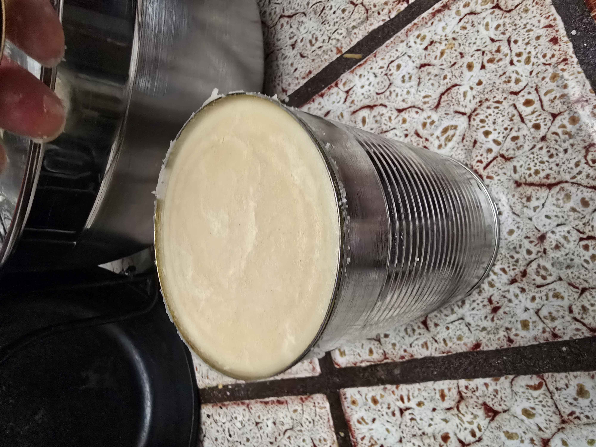
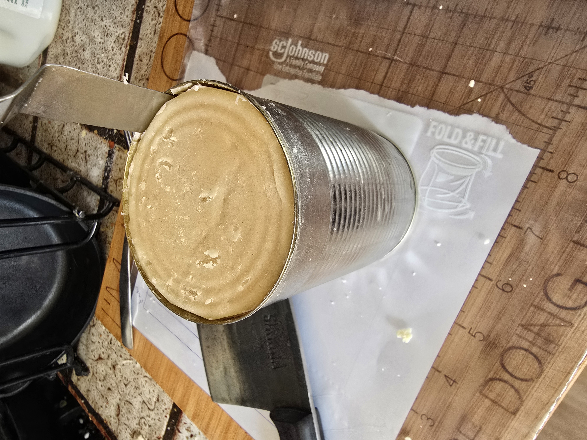
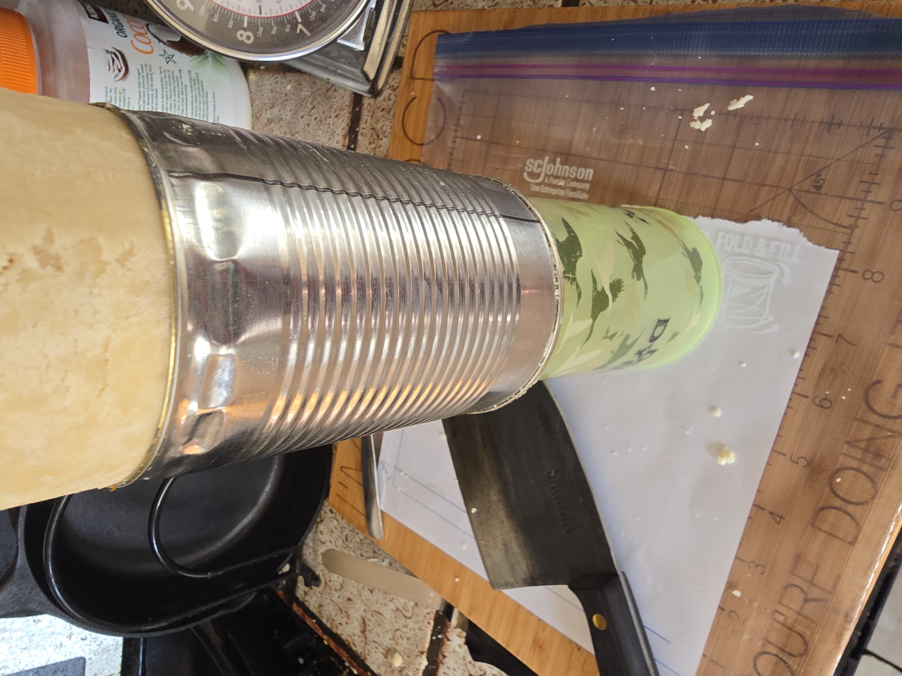
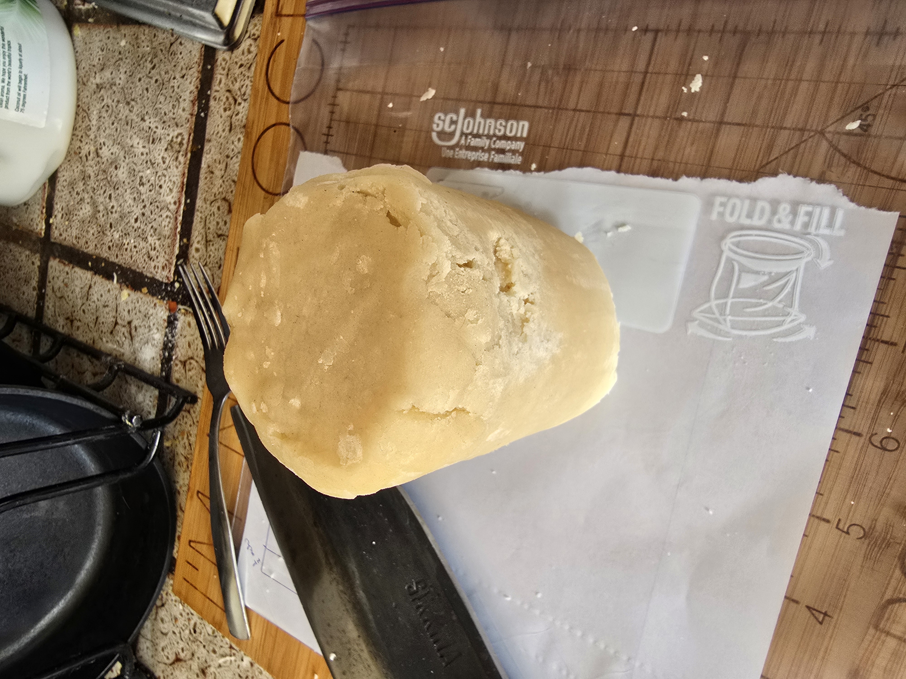

The Can Experiment
==================

One of the reasons I like sustainable practices is that it makes me happy when I have one less thing to worry about having on-hand.

I attempted to replace the tinfoil wrapping with tin cans (in this case, they'd housed beans in their previous life). Sadly this did not go well :sob:

The idea was pretty simple, use one of the can-openers that doesn't leave a sharp edge to remove the top and bottom lid, and use it as a combination form and storage for the dough.

This seemed promising, even though getting the dough back out took a bit of work. First I had to separate the dough from the sides of the can.

That didn't fully do it, so I resorted to using a cup to force the dough to stay put while the tin can was pulled down.

That worked, but was rather difficult. The ridges on the can probably didn't help.

The thing that really killed it though was that the resulting log was too wide, and it didn't cut well.

I don't know if I have the patience to try it again with tomato paste cans, because of how many I'd need to use, but I might circle back and try it again.