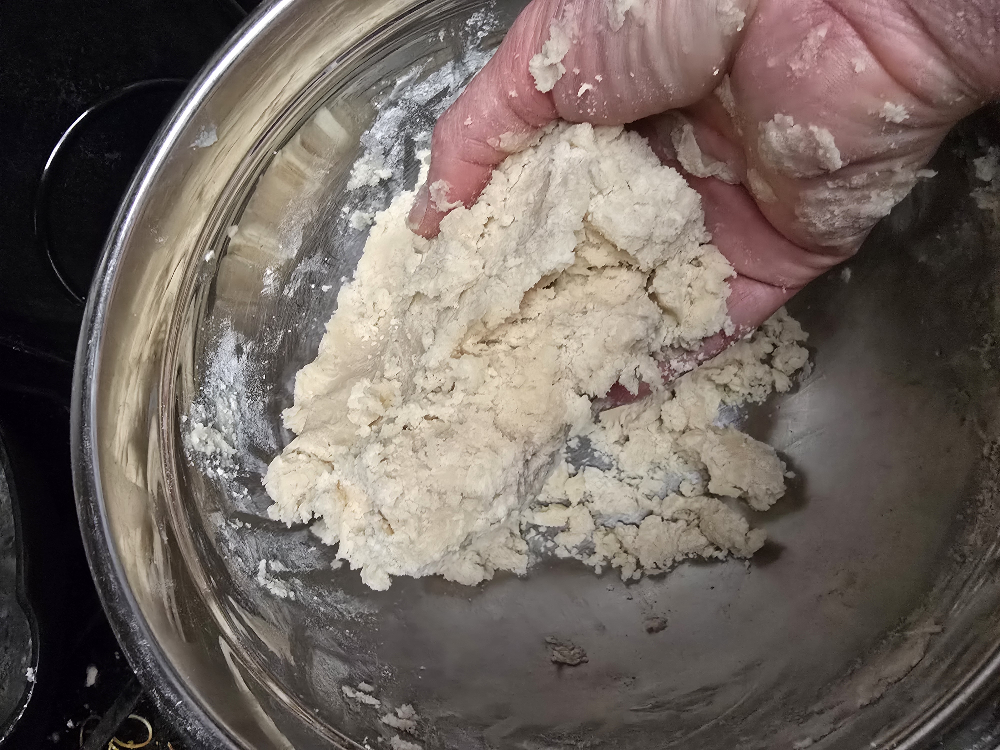
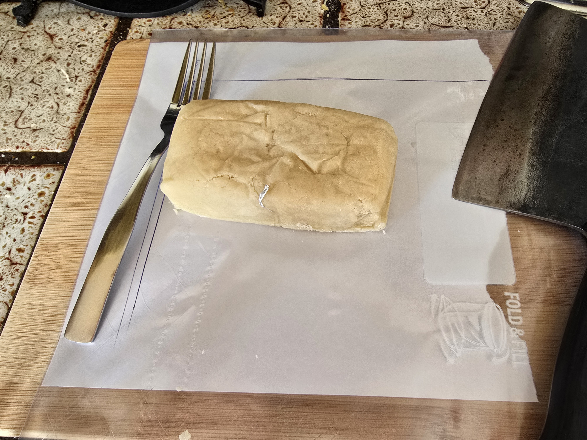
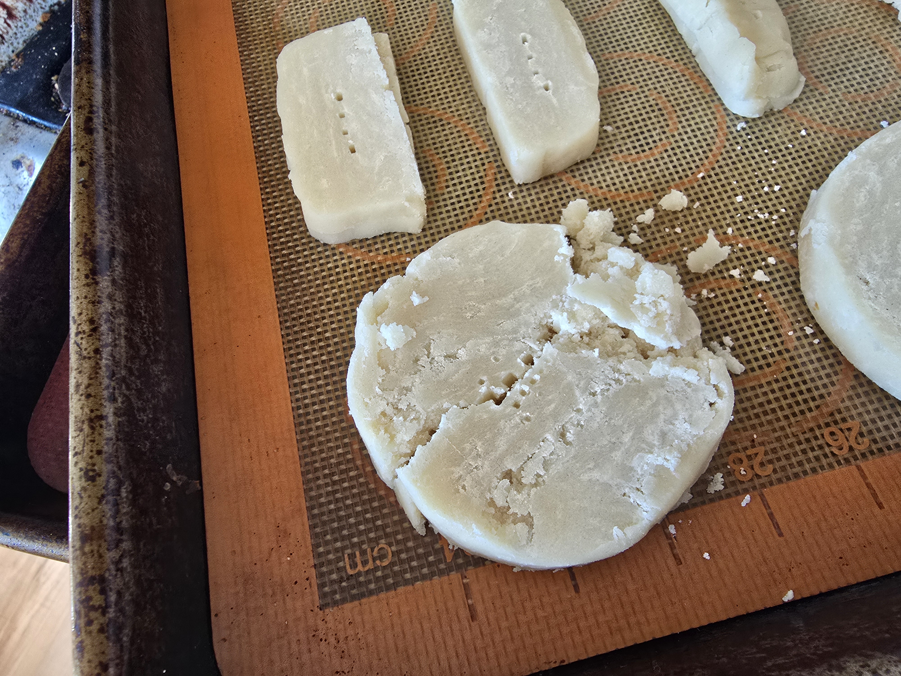

Shortbread Cookie Recipe
========================

[TL;DR](./TLDR.md)

Time Investment
---------------

One night to 3 days before cooking:
- However long it takes to soften the butter
- About 15 minutes of of mixing

On cooking day:
- However long it takes your oven to preheat to 320°F
- About 20 minutes per batch to cook
- About 10 minutes per batch to cool

Ingredients
-----------

| What                      | Single Batch | Double Batch | Triple Batch | Notes                                         |
| ------------------------- | ------------ | ------------ | ------------ | --------------------------------------------- |
| Sugar                     | 125g         | 250g         | 375g         |                                               |
| Salted Butter (room temp) | 250g         | 500g         | 750g         | You can also use [unsalted](./Butter.md)      |
| All-Purpose Flour         | 350g         | 700g         | 1050g        |                                               |
| Vanilla extract           | 1 tsp        | 2 tsp        | 3 tsp        | Optional, measure with your heart on this one |

Hardware
--------

### Required
- Mixing bowl
- Mixing spoon
- Fork or other pointy object
- Sharp knife
- Baking sheets
- Tin foil

### Infrastructure
- Refrigerator
- Oven
- Flat surface large enough to shape
- Cutting board

### Optional
- Stand mixer
- Silicone baking mats

Instructions: Prep
------------------

### Warm The Butter

The butter needs to be really soft, like squishy soft, so stick it on the counter for an hour or so and go do something else. It should look like this when it's ready:

I cannot stress how little effort it took to squish that butter. You can start before it gets to that point, but it'll be easier if it's softer.

### Cream Everything Except The Flour

Add everything except for the flour into a mixing bowl and beat it until it's creamy and the streaks are gone.

> [!NOTE]
> The original recipe adds the salt to the flour, but I find it easier to mix it with the butter. Since that's effectively the same as using unsalted butter, it's unsurprising that it works just as well.

Here's what this looks like for a single batch:

You don't want to see these:

> [!TIP]
> A stand mixer can be helpful for this part. If you're mixing by hand, congratulations, you're done with the hardest part (by a fair margin).

### Mix The Flour

Shortbread cookies want as little gluten development as possible, so we want to do as little mixing in this part as we can get away with. If you used a stand mixer for the previous step, do not use it for this part, it's way too easy to overdo it.

> [!CAUTION]
> If there's any worry the other ingredients aren't mixed well enough, go back and fix that before adding the flour.

Add the flour to the bowl, which looks like this for a single batch:

Mix the flour in until it's barely incorporated. The motion you want is less of a "mix" than a "fold and squish". Stop as soon as you see it looking like this instead of like just flour:

Wipe off the spoon into the bowl and switch to using your hands. The motion you want is sort of like kneading, but it's almost closer to just squeezing it together. Stop when it holds together well enough to be able to removing it from the container.

### Shape The Dough

Shape the dough into a square-ish log (mine usually ends up more rectangular), more or less like this:

You can make this as long as you'd like, this one's a bit short because I was [experimenting with something](./Can-Experiment.md) when I took the pictures, but you can make them as long as makes sense for your workspace.

> [!TIP]
> The cross-section of this log will determine the shape of your cookies, so keep that in mind when making your logs.

Stick that in the fridge, and call it a night.

Instructions: Cooking
---------------------

Some time between the next morning and 3 days after, preheat your oven to 320°F.

While the oven is preheating, it's helpful to prepare a cutting template, because getting a consistent width will help make sure everything gets cooked evenly.

> [!IMPORTANT]
> Ignore the measurement in the photo, I misread the instructions when I made it, it's supposed to be 1/2 inch :facepalm:.

### Cut Out The Cookies

Unwrap the dough and place it on the cutting board.

> [!CAUTION]
> Make sure to remove all the foil, as sometimes a bit gets stuck. This is why I don't generally recommend freezing this dough, as it makes it a pain in the neck to remove all the foil.
>
> 

I find it easiest to cut them by placing the knife on the first line, and using it as a stop, rather than trying to line up the end of the dough log with the first line.

Once cut, place the cookie on the baking sheet, and use a fork or other pointy object to make a few holes that should go all the way to through the cookie.

Any extra dough should go back in the fridge until it's time to cut out the next batch. The dough is easier to work with when it's a bit chilly.

### And ... Bake!

Once the oven is ready, put the cookie sheet(s) in the oven.

Set the timer for 8 minutes.

After 8 minutes, rotate the cookie sheets. If you have one sheet, just give it a half-turn. If you have two sheets, I'll usually turn them and swap the top and bottom sheets. If you have more than two sheets, I envy your oven and you probably know what to do.

Set the timer for 8 minutes.

After 8 minutes, we get into a kind of squishy area. Every oven is unique, and the temperature on the oven isn't always the temperature inside the oven, so your cookies may take more time. I usually check every 2 minutes until they are done.

The ideal is to catch it after the bottom edge starts to show a bit of golden brown, and before the rest of the cookie starts to turn. You want these pale. This is easier than it sounds, because the cooking temperature is kept low.

Ignore the shape of the cookie, it was part of the [previously mentioned experiment](./Can-Experiment.md).

My oven usually takes another 4 minutes before it's ready, but I don't trust it, so I do the 8/8/2/2 routine, even though it's been pretty consistent.

### Cooling Down

Let the cookies rest on the sheet for about 5 minutes, then move to a cooling rack for at least 10 minutes (be gentle, they're still pretty fragile at this point).

> [!TIP]
> Sometimes they won't want to leave the baking sheet, and a gentle twist can separate them without damaging the cookie.

> [!TIP]
> You do not need to let the baking sheet cool down if you're doing multiple batches, once the last batch has had their 5 minutes and have been moved to the racks, you can immediately put the next batch in.

### Storage

Assuming they aren't eaten directly off the cooling racks by the kids, these can apparently be stored in a container on the counter for about a week. One day I'll make a batch big enough to find out if that's actually true, the longest they've lasted without being eaten was 3 days.

Notes
-----

This recipe is really forgiving, as long as you are _very_ gentle when mixing the flour.

This cut from the [oft-mentioned experiment](./Can-Experiment.md) looks like an absolute disaster:

However, this was easily be pressed back into shape:

And it came out so well I couldn't actually figure out which one was the broken one :sweat_smile:

Another common problem is getting a bit too stabby with the fork and splitting the cookie:

Pressed back together and cooked does leave an imperfection on the top:

However the cookie bottom shows how nicely the structure has healed:

Acknowledgements
----------------

This recipe is based on [30 Minute Shortbread
Cookies](https://cloudykitchen.com/blog/shortbread-cookies-recipe/) by Erin
Clarkson, with my commentary, tips, and photos.

